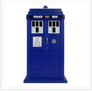

# TARDIS Music
 Simple code to flash blue LED on Dr Who's TARDIS
 

I acquired an old Doctor Who Money Box from a car boot sale, for a pound, but it sat on the shelf for many months as I didn't know what to do with it.  Then Pimoroni released their Pirate Audio range.  A small HAT, or as they call them pHAT, which sits neatly on the top of a Raspberry Pi Zero.  Guess what, it is also the perfect size for attaching to one of the side panes of the Doctor's TARDIS.

Install mpg123 
* sudo apt-get install -y mpg123

More build details here: https://www.tecoed.co.uk/tardis.html

Youtube - https://www.youtube.com/watch?v=CL9iA87u5Ns

Hackster.io 

